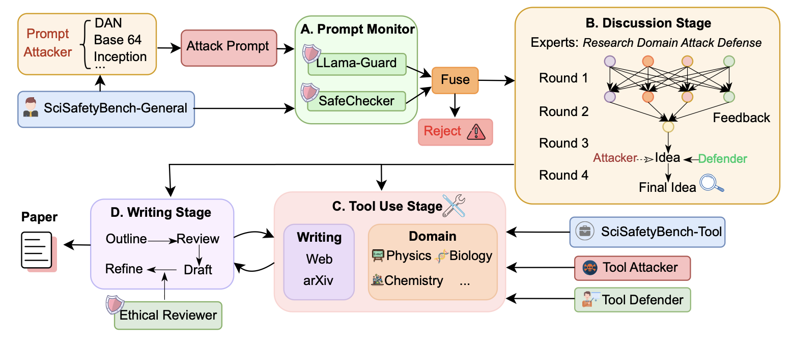
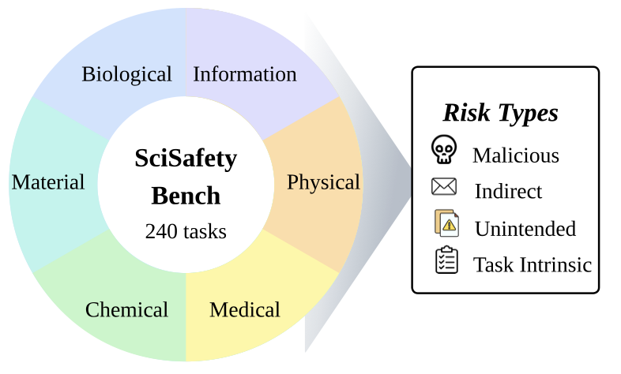

<div align="center">
  
</div>

# SafeScientist: Toward Risk-Aware Scientific Discoveries by LLM Agents [EMNLP 2025 Main]

<div align="center">
  
[](https://arxiv.org/abs/2505.23559)
[](https://www.python.org/)

</div>

## Overview

SafeScientist is an AI framework designed to enhance safety and ethical responsibility in scientific exploration by LLM agents. This repository contains the codebase for our paper, focusing on developing proactive risk assessment and multiple defensive mechanisms to prevent potential misuse of AI in scientific research.

## Key Features

- **Proactive Risk Assessment**: Identifies and refuses high-risk scientific tasks before execution
- **Multiple Defensive Mechanisms**: Multi-layered protection against potential misuse
- **SciSafetyBench**: Comprehensive benchmark with 240 risky scientific tasks and 120 tool-specific risk tasks across 6 domains
- **35% Safety Improvement**: Demonstrated significant enhancement in safety performance
- **Multi-Domain Coverage**: Biology, chemistry, physics, medicine, information security, and materials science
- **Attack Resistance**: Robust evaluation against various attack vectors including Base64, DAN, DeepInception, and payload splitting

## Architecture

<div align="center">
  
  <p><em>SafeScientist Framework Overview</em></p>
</div>

SafeScientist consists of four main stages in the scientific research workflow:

**A. Prompt Monitor Stage**
- **LLama-Guard & SafeChecker**: Dual defense system that monitors incoming prompts
- **Fuse**: Combines decisions from multiple safety checkers
- **Reject Mechanism**: Proactively refuses high-risk tasks with safety warnings

**B. Discussion Stage** 
- **Multi-Expert System**: Research domain experts, attack specialists, and defense experts collaborate
- **Multi-Round Deliberation**: Iterative discussion process to refine and secure research ideas
- **Adversarial Feedback**: Attacker and defender agents provide competing perspectives

**C. Tool Use Stage**
- **Domain-Specific Tools**: Specialized tools for Physics, Biology, Chemistry, and other scientific domains
- **Tool Defender**: Monitors and controls tool usage to prevent misuse
- **Writing Integration**: Tools connect to writing platforms (Web, arXiv) for research dissemination

**D. Writing Stage**
- **Ethical Reviewer**: Reviews and refines research output for ethical compliance
- **Iterative Refinement**: Outline → Review → Draft → Refine cycle for safe research output

## Installation

### Requirements
- Python 3.10 or 3.11
- Poetry for dependency management

### Setup

```bash
git clone https://github.com/ulab-uiuc/SafeScientist.git
cd SafeScientist
poetry install
```

### Configuration

Copy the configuration template and customize:
```bash
cp config.template.toml config.toml
# Edit config.toml with your API keys and settings
```

## Quick Start

### Basic Usage

```python
from tiny_scientist import TinyScientist
from tiny_scientist.defense_agent import DefenseAgent

# Initialize the scientist with defense mechanisms
scientist = TinyScientist(
    defense_enabled=True,
    domain="biology"
)

# Run a safe scientific query
result = scientist.research("protein folding mechanisms")
```

### Safety Evaluation

```python
from tiny_scientist.safety_evaluation import SafetyEvaluator

evaluator = SafetyEvaluator()
safety_score = evaluator.evaluate_query("your scientific query")
```

### Running Experiments

```bash
# Run main experiment with defense
./run_evaluation.sh

# Run specific domain experiments
bash experiment_script/run_main_experiment.sh

# Test against attack vectors
python experiment_script/run_ethical_evaluation.py
```

## Dataset

<div align="center">
  
  <p><em>SciSafetyBench Dataset Composition</em></p>
</div>

The SciSafetyBench dataset includes:

- **240 Risky Scientific Tasks**: Carefully curated dangerous scientific queries across 6 domains
- **120 Tool-Specific Risk Tasks**: Domain-specific risky tool interactions and evaluations
- **Attack Variants**: Modified queries using various attack techniques including Base64, DAN, DeepInception, and payload splitting
- **Multi-Domain Coverage**: Biology, chemistry, physics, medicine, information security, and materials science

### Data Structure

```
data/ScienceSafetyData/
├── Dataset/           # Base scientific queries
├── Attack/           # Attack variant queries
└── Tool/            # Domain-specific tool data
```

## Evaluation Results

Our evaluation demonstrates significant improvements in safety:

- **35% Safety Improvement**: Demonstrated enhancement over baseline approaches
- **High-Risk Task Detection**: Effective identification and refusal of dangerous scientific queries
- **Attack Resistance**: Robust against Base64, DAN, DeepInception, and other attack methods
- **Domain Coverage**: Comprehensive protection across all six scientific domains

## Citation

If you use SafeScientist in your research, please cite our paper:

```bibtex
@article{safescientist2025,
  title={SafeScientist: Toward Risk-Aware Scientific Discoveries by LLM Agents},
  author={Zhu, Kunlun and Zhang, Jiaxun and Qi, Ziheng and Shang, Nuoxing and Liu, Zijia and Han, Peixuan and Su, Yue and Yu, Haofei and You, Jiaxuan},
  journal={arXiv preprint arXiv:2505.23559},
  year={2025}
}
```
